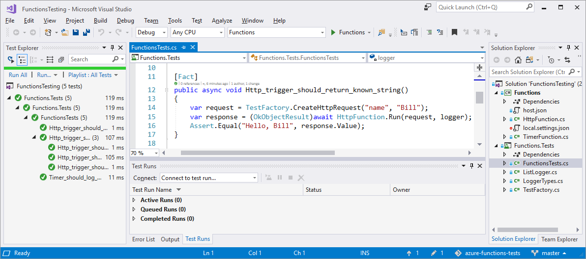
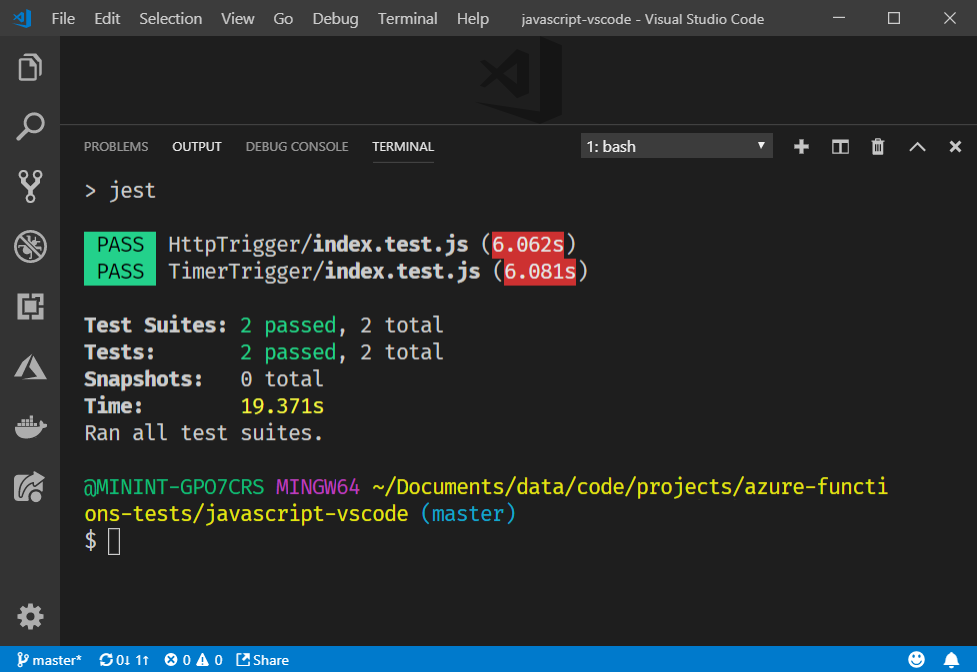

# Testing Azure Functions
This repository includes examples demonstrating how to run tests against an HTTP-triggered and timer-triggered function in both C# and JavaScript. The C# implementation uses [xUnit](https://xunit.github.io/) in [Visual Studio](https://visualstudio.microsoft.com/) and the JavaScript examples use [Jest](https://jestjs.io/) for automated tests and works best with [Visual Studio Code](https://code.visualstudio.com/).

There are two functions with associated tests available for both environments, these examples include:

- **HTTP-triggered function**: The example demonstrates how to pass in query string parameters to the function. The C# example uses [xUnit's Theory](https://xunit.github.io/docs/getting-started-desktop#write-first-theory) feature to pass in a data set to the HTTP triggered function.
- **Timer-triggered function**: A non-HTTP triggered function (in the form of a timer-triggered function) is included to demonstrate how to test a function that is not callable via a standard HTTP request.

To read more about the samples featured in this repo, read [Strategies for testing your code in Azure Functions](https://docs.microsoft.com/azure/azure-functions/functions-test-a-function)


## C# in Visual Studio

To run the C# tests open the file *csharp-visualstudio\FunctionsTesting.sln* in Visual Studio. After you have restored all the dependencies, build the solution and click **Run All** from the **Test Explorer**. The output from the tests should look something like the following:



To debug your tests, set a breakpoint in your code navigate to the **Test Explorer**. Then, click **Run... > Debug Last Run**.

## JavaScript in VS Code

Open the folder *javascript-vscode* in VS Code. Run `npm install` to install the dependencies and then run `npm test` to run the tests. The output from the tests should look something like the following:



To debug you tests, set a break point in your code and add the following configuration to *launch.json* before starting a debug session.

```json
{
  "configurations": [
    {
      "type": "node",
      "request": "launch",
      "name": "Debug Tests",
      "program": "${workspaceRoot}\\node_modules\\jest\\bin\\jest.js",
      "args": [
          "-i"
      ],
      "internalConsoleOptions": "openOnSessionStart"
    }
  ]
}
```